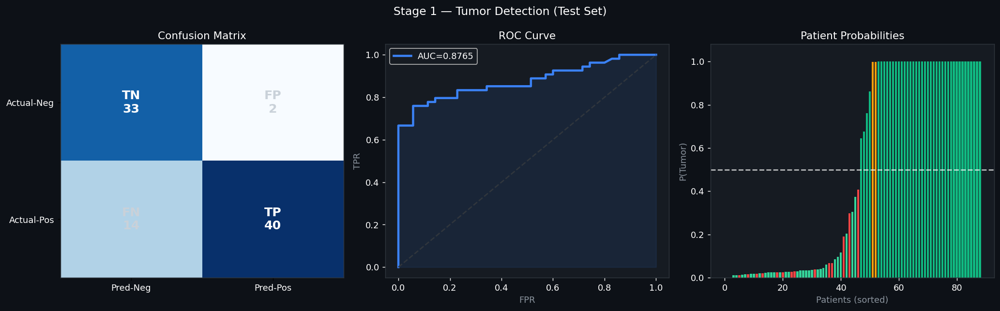
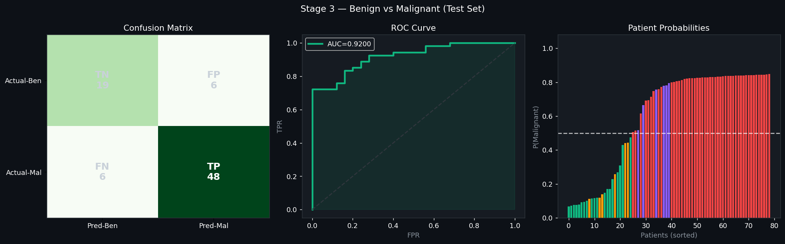
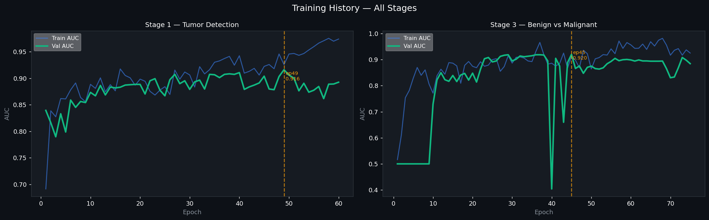
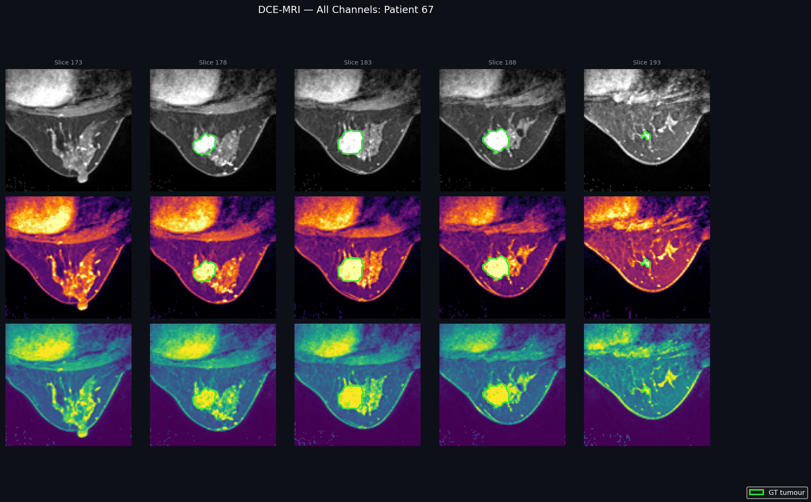
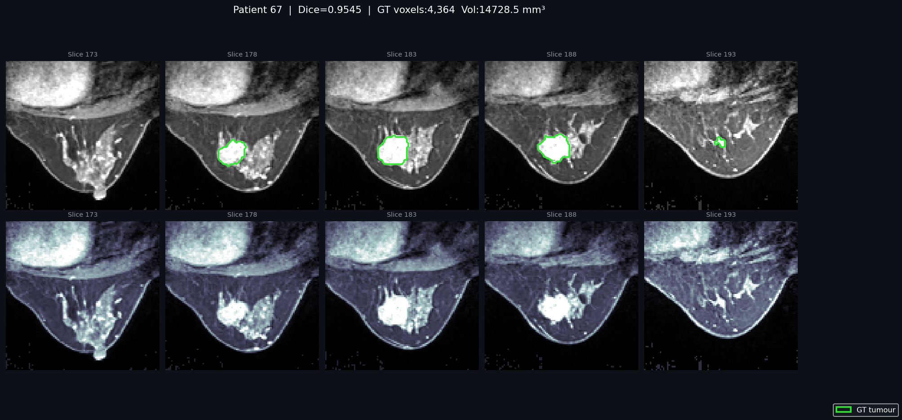
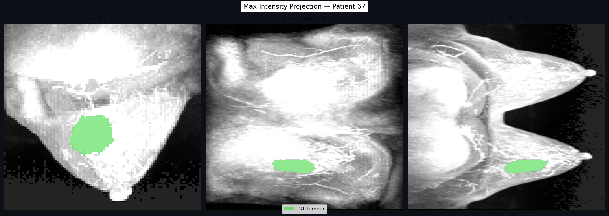
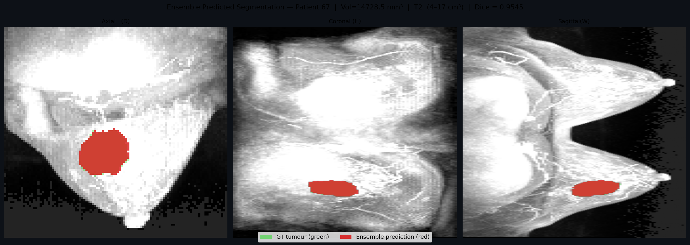
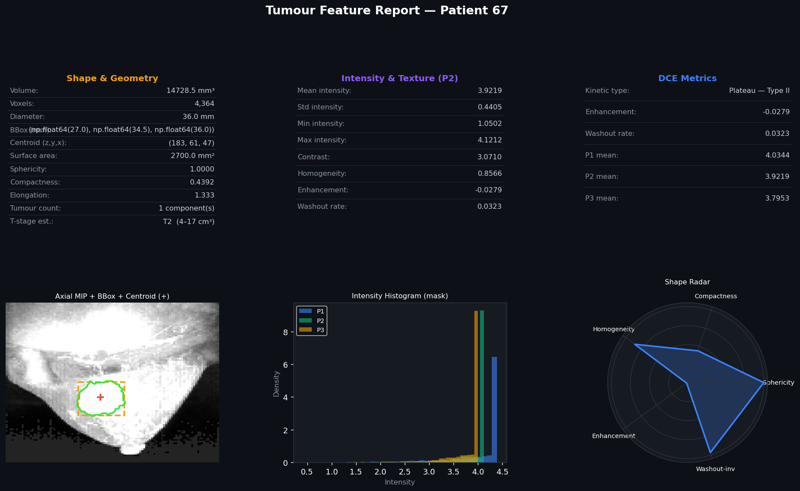
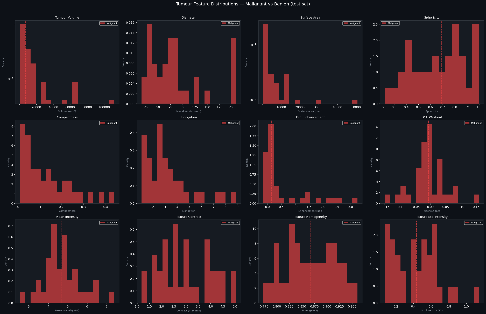
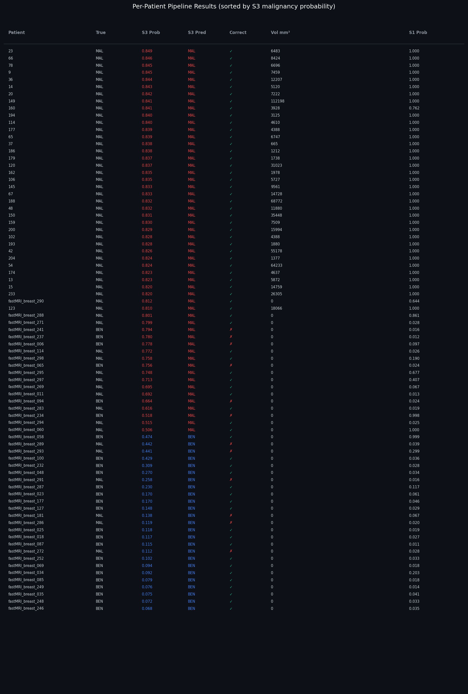

<div align="center">


<br><br>

# 🔬 Breast Tumor AI — 3-Stage DCE-MRI Pipeline

**A complete end-to-end deep learning pipeline for breast MRI tumor detection, segmentation, and malignancy classification using 3-channel Dynamic Contrast-Enhanced MRI (DCE-MRI) volumes.**

<br>

[🧠 Models on Hugging Face](https://huggingface.co/B1015/breast-tumor-ai) &nbsp;|&nbsp;
[📁 GitHub Repository](https://github.com/BhaveshN1015/Breast_Tumor_Detection-Classification) &nbsp;|&nbsp;
[▶️ Demo Video](#-demo-video) &nbsp;|&nbsp;
[🚀 Quick Start](#-setup--installation)

</div>

---

> ⚠️ **Medical Disclaimer:** This project is a **research prototype only** and is **not intended for real clinical diagnosis**. All results are for academic and demonstration purposes. Do not use this system to make any medical decisions.

---

## 📋 Table of Contents

- [Pipeline Overview](#-pipeline-overview)
- [Results](#-results)
- [Visual Results](#-visual-results)
- [Demo Video](#-demo-video)
- [Model Architectures](#-model-architectures)
- [Research Papers](#-research-papers)
- [Dataset](#-dataset)
- [Repository Structure](#-repository-structure)
- [Setup & Installation](#-setup--installation)
- [Running the Streamlit App](#-running-the-streamlit-app)
- [Tumor Feature Extraction](#-tumor-feature-extraction)
- [Hardware](#-hardware)

---

## 🧩 Pipeline Overview

Each DCE-MRI volume contains three temporal phases of contrast agent uptake:

| Phase | Name | Timing | Role |
|-------|------|--------|------|
| **P1** | Pre-contrast | Before injection | Baseline tissue signal |
| **P2** | Peak enhancement | ~90 s post-injection | Maximum tumor enhancement |
| **P3** | Delayed / Washout | ~3–5 min post-injection | Kinetic characterisation (Type I/II/III) |

```
┌─────────────────────────────────────────────────────────┐
│         Input: 3-channel DCE-MRI Volume (P1·P2·P3)      │
└──────────────────────────┬──────────────────────────────┘
                           │
                           ▼
         ┌─────────────────────────────────┐
         │  STAGE 1 — Tumor Detection      │
         │        3D ResNet18   │
         │  Output: Tumor probability      │
         └───────────┬─────────────────────┘
                     │  if positive (≥ threshold)
                     ▼
         ┌─────────────────────────────────┐
         │  SEGMENTATION — Mask Prediction │
         │  MONAI UNet3D (35%) +           │
         │  DynUNet(65%)        │
         │  Sliding-window · 96³ patches   │
         │  Output: 3D tumor mask          │
         └───────────┬─────────────────────┘
                     │
                     ▼
         ┌─────────────────────────────────┐
         │  STAGE 3 — Malignancy Classif.  │
         │  3D EfficientNet-B0             │
         │  Output: Benign / Malignant     │
         └─────────────────────────────────┘
```

---

## 📊 Results

| Stage | Model | Parameters | Metric | Score |
|-------|-------|-----------|--------|-------|
| **Stage 1 — Detection** | 3D ResNet18 | 33.4 M | Test AUC | **0.8765** |
| **Segmentation** | MONAI UNet3D + DynUNet Ensemble | — | Mean Dice | **0.80** |
| **Segmentation** | MONAI UNet3D + DynUNet Ensemble | — | Best Dice (Patient 67) | **0.9582** |
| **Stage 3 — Classification** | 3D EfficientNet-B0 | 4.7 M | Test AUC | **0.9200** |

<details>
<summary><b>📖 How to interpret these metrics</b></summary>

**AUC (Area Under the ROC Curve):** Ranges 0–1; a score of 1.0 is a perfect classifier and 0.5 is random chance. An AUC of **0.8765** for Stage 1 means the model correctly ranks a tumor patient above a normal patient ~88% of the time. An AUC of **0.9200** for Stage 3 (benign vs. malignant) represents strong clinical-grade discriminative ability.

**Dice Coefficient:** Measures volumetric overlap between the predicted tumor mask and the ground-truth annotation (range 0–1, where 1 = perfect). A **mean Dice of 0.80** across the test set is solid performance for 3D breast MRI segmentation. The **best single-patient Dice of 0.9582** (patient 67, full sliding-window inference) demonstrates the ensemble's capability on well-defined tumors.

> **Segmentation inference note:** The pipeline uses sliding-window inference on the full 3D volume (96³ patches, 0.5 overlap) with a MONAI:DynUNet ensemble blend of 0.35:0.65. This exactly replicates the training evaluation protocol and avoids spatial-cropping artifacts that would otherwise reduce Dice by ~0.05.

</details>

---

## 🖼️ Visual Results

### Stage 1 — Tumor Detection (Test Set)
> Confusion matrix · ROC curve (AUC = 0.8765) · Per-patient tumor probability bar chart



---

### Stage 3 — Benign vs. Malignant (Test Set)
> Confusion matrix · ROC curve (AUC = 0.9200) · Per-patient malignancy probability bar chart



---

### Training Curves — All Stages
> Train AUC vs. Val AUC per epoch for Stage 1 and Stage 3. Dashed amber line marks best validation epoch.



---

### Segmentation — All 3 DCE Channels + GT Contour
> All three DCE phases shown with ground-truth tumor contour overlay per axial slice.



---

### Segmentation — Axial Slice Overlay
> P2 (peak enhancement) channel with green GT contour and red predicted mask contour overlaid.



---

### Segmentation — Max-Intensity Projections (3 Axes)
> Axial · Coronal · Sagittal MIPs with GT (green overlay) and predicted mask (red overlay). Patient 67, Dice = 0.9582.



---

### Segmentation — 3D Volume Render
> Filled 3D MIP render of predicted tumor volume.



---

### Segmentation — Feature Panel (Patient 67)
> Geometry · Texture · DCE kinetics · Intensity histogram inside mask · Shape radar chart.



---

### Tumor Feature Distributions — Malignant vs. Benign
> 12-panel histogram grid comparing malignant (red) vs. benign (green) distributions across volume, diameter, surface area, sphericity, compactness, elongation, DCE enhancement/washout, intensity statistics, and texture metrics. Dashed verticals show medians.



---

### Per-Patient Results Table
> Full test-set table sorted by Stage 3 malignancy probability. Columns: patient ID, true label, S3 probability, predicted label, correct/incorrect tick, tumor volume (mm³), Stage 1 probability.



---

## ▶️ Demo Video

> The video below shows the complete Streamlit app running end-to-end: model loading, patient upload, Stage 1 detection, segmentation overlay, Stage 3 classification, and feature panel.

<!-- Replace the link below with your actual YouTube unlisted video URL -->
[](https://youtu.be/zcFZ07l4b3c)

## or


> **Note on video hosting:** GitHub's free plan limits video uploads to 10 MB. Since the demo video is 38 MB, it is hosted on YouTube (unlisted). To push the video to GitHub via Git LFS instead, run:
> ```bash
> git lfs track "*.mp4"
> git add .gitattributes
> git add demo/demo_video.mp4
> git commit -m "Add demo video via LFS"
> git push origin main
> ```
> Git LFS supports files up to 2 GB on the free tier. The above commands track `.mp4` with LFS, bypassing GitHub's standard 100 MB hard limit.

---

## 🏗️ Model Architectures

### Stage 1 — 3D ResNet18
```
Input: (B, 3, D, H, W)
  └─ Conv3d stem (7×7×7, stride 2)
  └─ MaxPool3d
  └─ Layer1: 2× BasicBlock3D  [64 ch]
  └─ Layer2: 2× BasicBlock3D  [128 ch, stride 2]
  └─ Layer3: 2× BasicBlock3D  [256 ch, stride 2]
  └─ Layer4: 2× BasicBlock3D  [512 ch, stride 2]
  └─ AdaptiveAvgPool3d → Dropout(0.5)
  └─ Linear(512 → 1) + Sigmoid
Total: 33.4 M parameters
Loss:  Focal-BCE (γ=2, α=0.25) + Label Smoothing (ε=0.1)
```

---

### Segmentation Ensemble — MONAI UNet3D + DynUNet
```
MONAI UNet3D
  Channels:    (3) → 32 → 64 → 128 → 256 → 512
  Strides:     (2, 2, 2, 2)
  Residual:    True   |   Norm: InstanceNorm3D
  Dropout:     0.1    |   Loss: Tversky (α=0.3, β=0.7) + Focal

DynUNet
  Kernels:     [[3,3,3],[3,3,3],[3,3,3],[3,3,3],[3,3,3]]
  Strides:     [[1,1,1],[2,2,2],[2,2,2],[2,2,2],[2,2,2]]
  Deep supervision weights: [1.0, 0.5, 0.25, 0.125, 0.0625]
  Loss:        Tversky + Focal

Ensemble blend:  MONAI 0.35 × pred  +  DynUNet 0.65 × pred
Inference:       Sliding-window · patch 96³ · overlap 0.5 · Gaussian weighting
```

---

### Stage 3 — 3D EfficientNet-B0
```
Input: (B, 3, D, H, W)
  └─ Stem Conv3d (3×3×3, stride 2)
  └─ MBConv3D blocks (B0 scaling: width×1.0, depth×1.0)
  └─ Head Conv3d → AdaptiveAvgPool3d
  └─ Dropout(0.4) → Linear(1280 → 1) + Sigmoid
Total: 4.7 M parameters
Loss:  BCE with Label Smoothing (ε=0.1)
```

---

## 📚 Research Papers

### Core Architectures Used

| Architecture | Paper | Venue | Link |
|---|---|---|---|
| **ResNet** | He et al., *Deep Residual Learning for Image Recognition* | CVPR 2016 | [arXiv:1512.03385](https://arxiv.org/abs/1512.03385) |
| **U-Net** | Ronneberger et al., *U-Net: Convolutional Networks for Biomedical Image Segmentation* | MICCAI 2015 | [arXiv:1505.04597](https://arxiv.org/abs/1505.04597) |
| **DynUNet** | Isensee et al., *nnU-Net: a self-configuring method for deep learning-based biomedical image segmentation* | Nature Methods 2021 | [DOI:10.1038/s41592-020-01008-z](https://www.nature.com/articles/s41592-020-01008-z) |
| **EfficientNet** | Tan & Le, *EfficientNet: Rethinking Model Scaling for Convolutional Neural Networks* | ICML 2019 | [arXiv:1905.11946](https://arxiv.org/abs/1905.11946) |
| **MONAI Framework** | Cardoso et al., *MONAI: An open-source framework for deep learning in healthcare* | arXiv 2022 | [arXiv:2211.02701](https://arxiv.org/abs/2211.02701) |

### Relevant Medical Imaging Research

| Topic | Paper | Venue | Link |
|---|---|---|---|
| **DCE-MRI breast segmentation** | Wang et al., *Breast tumor segmentation in DCE-MRI with tumor sensitive synthesis* | IEEE TNNLS 2021 | [DOI](https://doi.org/10.1109/TNNLS.2021.3056238) |
| **DCE kinetic analysis** | Kuhl et al., *Dynamic breast MR imaging: are signal intensity time course data useful for differential diagnosis?* | Radiology 1999 | [DOI](https://doi.org/10.1148/radiology.211.1.r99ap38101) |
| **Tversky loss** | Salehi et al., *Tversky loss function for image segmentation using 3D fully convolutional deep networks* | MICCAI Workshop 2017 | [arXiv:1706.05721](https://arxiv.org/abs/1706.05721) |
| **Focal loss** | Lin et al., *Focal Loss for Dense Object Detection* | ICCV 2017 | [arXiv:1708.02002](https://arxiv.org/abs/1708.02002) |
| **Sliding-window inference** | Çiçek et al., *3D U-Net: Learning Dense Volumetric Segmentation from Sparse Annotation* | MICCAI 2016 | [arXiv:1606.06650](https://arxiv.org/abs/1606.06650) |

---

## 🗂️ Dataset

| Source | Patient IDs | Scanner | Notes |
|--------|-------------|---------|-------|
| Primary cohort | 1 – 233 | 1.5 T Cartesian | Core breast MRI cases |
| FastMRI | 234+ | 3 T radial GRASP | Additional acceleration cases |
| BreastDx normals | 234 – 249 | — | Extra negative (no-tumor) controls |

- **Input format:** Preprocessed 3-channel `.npy` volumes of shape `(3, D, H, W)` — one channel per DCE phase.
- **Voxel spacing assumed:** 1.5 mm isotropic (`VOXEL_MM³ = 3.375 mm³`).
- **Raw datasets are not included** in this repository. Place preprocessed `.npy` files in `data/patients_combined/` and `data/classification_stage{1,3}/` following the structure in `data/classification_split_summary.txt`.

### 🧪 Sample Test Patients

A small set of preprocessed sample patients is included in `sample_dataset/` for running the Streamlit demo:

| Folder | Label | Notes |
|--------|-------|-------|
| `sample_dataset/positive/67/` | Positive (tumor) | Patient 67 — best segmentation Dice 0.9582; includes `image.npy` + `label.npy` |
| `sample_dataset/negative/245/` | Negative (no tumor) | FastMRI case; includes `image.npy` only |

Download directly from GitHub:
```
https://github.com/BhaveshN1015/Breast_Tumor_Detection-Classification/tree/main/sample_dataset
```

---

## 📁 Repository Structure

```
Breast_Tumor_Detection-Classification/
│
├── src/
│   ├── segmentation_3d/            # MONAI UNet3D — model definition + training
│   ├── dynunet_3d/                 # DynUNet — model + ensemble
│   └── classification/
│       ├── stage1/                 # Tumor detection — 3D ResNet18
│       └── stage3/                 # Malignancy classifier — 3D EfficientNet-B0
│
├── notebooks/
│   └── full_pipeline.ipynb         # End-to-end evaluation pipeline
│   └── main_pipeline_v2_no_kinetics.ipynb
│
├── models/                         # Trained weights — stored via Git LFS
│   ├── classification_stage1/
│   │   ├── best_model_raw.pth      # Stage 1 checkpoint (~382 MB)
│   │   └── training_log.json
│   ├── classification_stage3/
│   │   ├── best_model.pth          # Stage 3 checkpoint (~54 MB)
│   │   └── training_log.json
│   ├── segmentation_3d/
│   │   └── unet3d_best_raw.pth     # MONAI UNet3D checkpoint (~50 MB)
│   └── dynunet_3d/
│       └── dynunet_best_raw.pth    # DynUNet checkpoint (~64 MB)
│
├── sample_dataset/
│   ├── positive/67/                # Sample tumor patient (image.npy + label.npy)
│   └── negative/234/               # Sample normal patient (image.npy)
│
├── outputs/                        # Generated plots and evaluation figures
├── app.py                          # Streamlit frontend app
├── download_models.py              # Auto-downloads weights from Hugging Face Hub
├── requirements.txt                # Full dependency list
├── requirements_app.txt            # Streamlit-only requirements
└── README.md
```

---

## 🚀 Setup & Installation

### Prerequisites

- Python 3.10
- CUDA 11.8+ (for GPU inference) — CPU inference also supported but slower
- Git with Git LFS installed

### 1. Clone the Repository

```bash
git clone https://github.com/BhaveshN1015/Breast_Tumor_Detection-Classification.git
cd Breast_Tumor_Detection-Classification
```

### 2. Install Git LFS and Pull Model Weights

```bash
# Install Git LFS (if not already installed)
git lfs install

# Pull the model .pth files tracked by LFS
git lfs pull
```

> Alternatively, model weights are available directly on Hugging Face Hub:
> **[huggingface.co/B1015/breast-tumor-ai](https://huggingface.co/B1015/breast-tumor-ai)**

### 3. Create Virtual Environment and Install Dependencies

```bash
# Using conda (recommended)
conda create -n breast_tumor python=3.10
conda activate breast_tumor

# Or using venv
python -m venv ml
ml\Scripts\activate         # Windows
source ml/bin/activate      # Linux / macOS

# Install all dependencies
pip install -r requirements.txt
```

### 4. Verify Installation

```bash
python -c "import torch; import monai; print('PyTorch:', torch.__version__); print('MONAI:', monai.__version__); print('CUDA:', torch.cuda.is_available())"
```

---

## 🖥️ Running the Streamlit App

The Streamlit app provides an interactive demo of the full pipeline.

### Quick Start

```bash
# Install Streamlit if not already in your environment
pip install streamlit plotly

# Run the app
streamlit run app.py
```

The app will open at `http://localhost:8501`.

### How to Use the App

**Step 1 — Accept the disclaimer** on the welcome screen.

**Step 2 — Download a sample patient** from GitHub:

```
https://github.com/BhaveshN1015/Breast_Tumor_Detection-Classification/tree/main/sample_dataset
```

Download either:
- `sample_dataset/positive/67/image.npy` + `label.npy` — tumor patient (for segmentation overlay)
- `sample_dataset/negative/234/image.npy` — normal patient

**Step 3 — Load models.** The app automatically downloads all 4 model checkpoints from Hugging Face Hub on first run (requires internet). Progress bars are shown for each download. On subsequent runs the cached local weights are used.

**Step 4 — Upload the `.npy` file(s)** using the file uploader in the sidebar.

**Step 5 — View results** stage by stage:
- Stage 1 probability gauge and detection result
- Segmentation overlay on axial slices + MIP views + ground-truth comparison (if `label.npy` uploaded)
- Stage 3 malignancy probability + tumor feature panel

### Models on Hugging Face Hub

| File | Path in Repo | Size |
|------|--------------|------|
| Stage 1 classifier | `models/classification_stage1/best_model_raw.pth` | ~382 MB |
| Segmentation UNet3D | `models/segmentation_3d/unet3d_best_raw.pth` | ~50 MB |
| Segmentation DynUNet | `models/dynunet_3d/dynunet_best_raw.pth` | ~64 MB |
| Stage 3 classifier | `models/classification_stage3/best_model.pth` | ~54 MB |

---

## 🧮 Tumor Feature Extraction

For each segmented tumor the pipeline extracts the following features, displayed in the feature panel and per-patient results table:

**Geometry**

| Feature | Description |
|---------|-------------|
| Volume | Voxel count × 3.375 mm³ |
| Surface area | Marching-cubes surface × 2.25 mm² |
| Max diameter | Largest bounding-box dimension (mm) |
| Sphericity | `π^(1/3) × (6V)^(2/3) / SA` — 1.0 = perfect sphere |
| Compactness | `V / (SA^(3/2))` |
| Elongation | Ratio of shortest to longest axis |
| T-stage | Estimated from max diameter (T1 ≤ 20 mm, T2 20–50 mm, T3 > 50 mm) |

**DCE Kinetics**

| Feature | Formula |
|---------|---------|
| Enhancement ratio | `(mean_P2 − mean_P1) / |mean_P1|` |
| Washout rate | `(mean_P2 − mean_P3) / |mean_P2|` |
| Kinetic type | Type I (Persistent): washout < 0.1 · Type II (Plateau): 0.1–0.2 · Type III (Washout): > 0.2 |

**Texture (P2 channel inside mask)**

Mean intensity · Std intensity · Min / Max intensity · Contrast `(max − min)` · Homogeneity `1 − std / (max − min)`

---

## ⚙️ Hardware

| Stage | GPU | VRAM | Notes |
|-------|-----|------|-------|
| Stage 1 training | RTX 3050 Laptop | 6 GB | Mixed-precision (AMP) |
| Segmentation + Stage 3 | RTX 2000 Ada | 16 GB | Sliding-window inference |
| Inference (all stages) | Any CUDA GPU | 4 GB+ | Falls back to CPU if no GPU |

Mixed-precision inference (`torch.cuda.amp`) is enabled automatically when a CUDA device is detected.

---

## 📜 License

This project is released for academic and research use. See [LICENSE](LICENSE) for details.

---

<div align="center">

**Built with** PyTorch · MONAI · Streamlit · Hugging Face Hub

<br>

⭐ If this project helped your research, please consider starring the repository.

</div>
